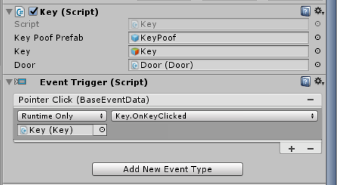

# Practica08-LaberintoVR
Práctica de Programación Hipermedial, desarrollo de un laberinto en VR usando Unity, y desplegando el mismo para dispositivos Android.

**PRÁCTICA DE LABORATORIO**

**CARRERA** : Computación

**ASIGNATURA** : Programación Hipermedial

**TÍTULO PRÁCTICA** : Desarrollo de una aplicación de realidad virtual usando la herramienta Unity y desplegada en un dispositivo móvil Android.

**OBJETIVOS ALCANZADOS** :

- Experimentar con aplicaciones de realidad virtual.
- Experimentar con aplicaciones de realidad aumentada.
- Distinguir la diferencia entre tecnologías de realidad virtual y realidad aumentada.

**ACTIVIDADES DESARROLLADAS**

<h3><strong>1. Desarrollar cada uno de los requerimientos planteados siguiendo las instrucciones brindadas en la guía de prácticas. </strong></h3>

En la guía de prácticas se detalla el proceso a seguir para la elaboración de este juego; en el presente informe se seccionarán las instrucciones en 3 partes: preparación de la escena y objetos, programación de comportamientos y diseño del laberinto.
En los siguientes puntos se detallará cada sección.

<h3><strong>2. Preparar la escena y los objetos del juego. </strong></h3>

 En esta parte se realiza la preparación del ambiente; de manera concreta, se puede decir que en esta primera parte se agregan los objetos y componentes necesarios para que el ambiente y los objetos sean interactivos.

En primer lugar, se agrega el GvrEditorEmulator (que vendría siendo la cámara), el GvrReticlePointer (el puntero). Además, se agregan scripts a los objetos que serán animados posteriormente, así como también los triggers que controlarán dichos comportamientos.

<h3><strong>3. Programar los comportamientos de los objetos. </strong></h3>

En esta sección se explicará acerca de la programación de los comportamientos (animaciones o acciones) que tendrán los objetos principales del juego y con los cuales el jugador va a interactuar.

<strong>A.	Programación del comportamiento de las monedas – Coins.</strong>

En sí, se pide que cuando el jugador “toque” las monedas estas desaparezcan mientras se muestra una animación de “humo” y un sonido. Además, se pide como un reto que las monedas giren sobre su eje mientras se ejecuta el juego.
Para ello se programa en el script ya definido en el proyecto, el cual en la sección anterior se agregó como componente al objeto Coin.

<strong>B.	Programación del comportamiento de la llave – Key.</strong>

En sí, se pide que cuando el jugador “toque” la llave esta tenga un comportamiento similar al que tienen las monedas. La única diferencia, es que también se llamará a un método de un objeto externo (en este caso el objeto Door). Para ello se programa en el script ya definido en el proyecto, el cual en la sección anterior se agregó como componente al objeto Key.

<strong>C.	Programación del comportamiento de la puerta – Door.</strong>

La programación de la puerta es la más compleja de todas. Se debe validar que se haya recolectado la llave, para que pueda comenzar con la animación de “apertura”. 
Además, como retos opcionales se pide reproducir otro sonido si la puerta está bloqueada y al comenzar la animación de apertura se desactiven los “Colliders” para evitar la interacción desde ese punto.

<strong>D.	Programación del comportamiento del cartel – SignPost.</strong>

El comportamiento de este “cartel”, es la de volver a cargar el juego (la escena) desde el inicio. Para ello, se debe tener en cuenta que el jugador no podrá interactuar con este cartel si es que antes no se ha logrado encontrar la/s llaves. 

<h3><strong>4.	Diseñar el escenario e implementar funcionalidades.</strong></h3>

En las secciones anteriores se preparaba el ambiente para la interacción entre la escena y el jugador, pero no había una estructura o diseño como tal del laberinto; en otras palabras se realizó la “lógica”. En esta sección se explicará de manera concreta el cómo se realizó el proceso de diseño y cuáles fueron los requisitos.

Como requisitos principales se plantea lo siguiente:

- Debe de haber un mínimo de 5 monedas en el juego.
- Debe de haber al menos una llave.
- Deben de haber “Waypoints” de manera que se pueda acceder a varios lugares de la escena.
- Se debe de diseñar el laberinto con los objetos que se encuentran en la escena.

Para cumplir con los requerimientos anteriores se diseñó un laberinto mediantemente grande, donde se encuentran distribuidos por todo el laberinto “Waypoints” y 5 monedas. Cerca del templo se encuentran dos monedas más, además de la llave que desbloquea la puerta.

Además, se agregaron ciertos objetos decorativos a través de toda la escena a manera de que se pueda mejorar la presentación del juego. En cuanto a la iluminación se modificó un poco la Luz Direccional para que tenga un ligero aspecto a “atardecer”, incluso se agregó un punto de luz dentro del templo para una mejor visualización del interior.

<h3><strong>5.	Desplegar el proyecto para dispositivos Android.</strong></h3>

Otra parte importante de la práctica es desplegar el juego para que pueda ser instalado y ejecutado en dispositivos móviles. Para ello se configuró ciertas opciones de “Player”. Además de habilitar el soporte para VR.

<h3><strong>6.	Presentar la aplicación en ejecución.</strong></h3>

<strong>A.	Ejecución en Unity.</strong>

<strong>B.	Ejecución en un móvil Android.</strong>

**RESULTADO(S) OBTENIDO(S)**:

- Se logró realizar con éxito las experimentaciones acerca de aplicaciones con realidad virtual y realidad aumentada.
- Se logró comprender acerca de las principales diferencias entre la realidad virtual y realidad aumentada.
- Se logró desarrollar e integrar módulos interactivos virtuales.
- Se logró sintetizar y reforzar los conocimientos fundamentales en cuanto al desarrollo de aplicación de VR.

**CONCLUSIONES** :

- Unity es una plataforma de diseño 3D, en donde se puede simular y realizar simulaciones, animaciones e integrar diferentes herramientas para la creación de aplicaciones para realidad virtual, pudiendo así también realizar las importaciones para poder desplegarlos en dispositivos móviles.

**RECOMENDACIONES** :

- Haber asistido a las sesiones de clase.
- Revisar el contenido teórico del tema.
- Realizar las preguntas respectivas al docente a cargo.
- Salvar de manera periódica el diseño a fin de evitar pérdidas por alguna falla del software.

**Estudiante:** Sarmiento Douglas Bryan Sarmiento.